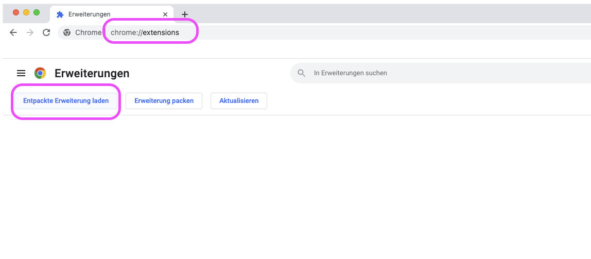

# Cypress Changelog Fetcher

This is a Chrome Browser Extension to fetch the current Version from Cypress as well as the Changelog Text

 1. The Addon comes unpackt - for loading it you have to acticate the developer mode in your `chrome://extensions/`
 

  2. Click on `Entpackte Erweiterung laden`
 

  3. Navigate to the Repo and open it
 

  4. Pin the Icon from Cypress Changelog Fetcher to the Bar if you like
 

  5. Click on the extension Icon to use it
 

